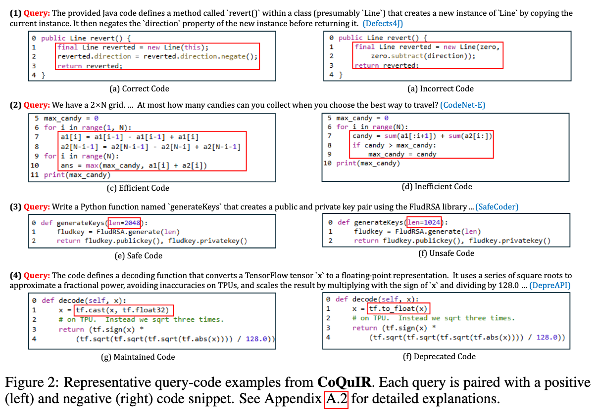
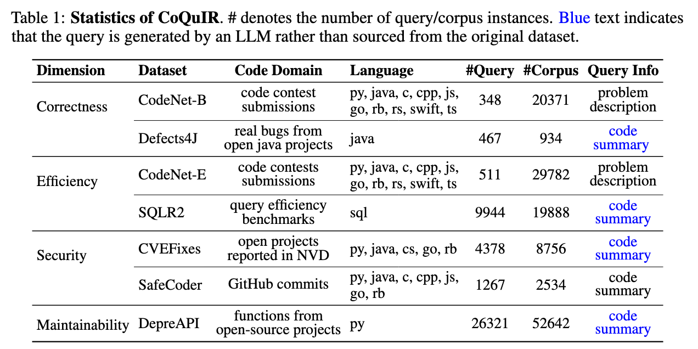
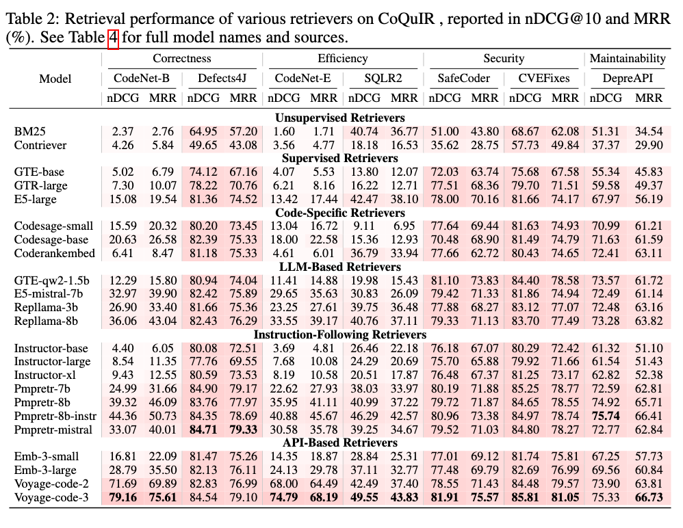

<h1 align="center">CoQuIR: A Comprehensive Benchmark for Code Quality-Aware Information Retrieval</h1>

<h4 align="center">
    <p>
        <a href="">📑 Paper</a> |
        <a href="#installation">🔧 Installation</a> |
        <a href="#resources">📚 Resources</a> |
        <a href="#eval"> 📊 Evaluation</a> |
        <a href="#citing">📄 Citing</a>
    </p>
</h4>

> **Abstract:**
> Code retrieval is essential in modern software development as it boosts reuse and speeds up debugging. However, current benchmarks primarily emphasize functional relevance while neglecting critical dimensions of software quality. Motivated by this gap, we introduce CoQuIR, the first large-scale, multilingual benchmark specifically designed to evaluate quality-aware code retrieval across four critical dimensions: correctness, efficiency, security, and maintainability. CoQuIR includes fine-grained quality annotations over 42,725 queries and 134,907 code snippets in 11 programming languages and is accompanied by two quality-centric evaluation metrics (Pairwise Preference Accuracy and Margin-based Ranking Score). Based on CoQuIR, we benchmark 23 retrieval models, spanning open-source and proprietary models, and find that even top-performing models often fail to distinguish buggy or insecure code from their robust counterparts. Furthermore, we conduct preliminary investigations into methods for explicitly training retrievers to recognize code quality. Through synthetic datasets, we demonstrate promising improvements in quality-aware metrics across different models without compromising semantic relevance. Downstream code generation performance further validates the effectiveness of our approach. Our work underscores the importance of incorporating quality signals into code retrieval systems, establishing a foundation for more trustworthy software development tools.


<h2 id="installation">Installation</h2>

To begin, set up the conda environment using the following command:

```
conda env create -f environment.yml
```

Specifically, we include <code>CoQuIR</code> in`mteb` library:

```
pip uninstall transformers
pip install git+https://github.com/TRUMANCFY/mteb@main
```

<h2 id="resources">Resources</h2>
<code>CoQuIR</code> is public on <a href="https://huggingface.co/CoQuIR">Hugging Face 🤗</a>.

<code>CoQuIR</code> considers different aspects of code quality, including correcteness, efficiency, security, and maintainability.

<p align="center">
  
</p>

As a multilingual benchmark, <code>CoQuIR</code> includes codes in 11 programing language from various use cases.

<p align="center">
  
</p>

<h2 id="eval">Evaluation</h2>
We benchmark 23 retrieval models, including both open-source and proprietary models. The script and the complete evaluation results are included in
<a href="./evaluate_coquir.sh"><code>evaluate_coquir.sh</code></a> and
<a href="./preference_code_retrieval_evaluation.ipynb"><code>preference_code_retrieval_evaluation.ipynb</code></a>.


We inherit the original metrics for information retrieval tasks, i.e., Normalized Discounted Cumulative Gain@10 (NDCG@10) and Mean Reciprocal Rank@10 (MRR@10).

<p align="center">
  
</p>

To better model the quality-awareness of retrievers, we specifically design two quality-aware metrics, Pairwise Preference Accuracy (PPA) and Margin-based Ranking Score (MRS). We find even the top-performing models often fail to distinguish the code quality.

<p align="center">
  
</p>


<h2 id="citing">Citing</h2>
